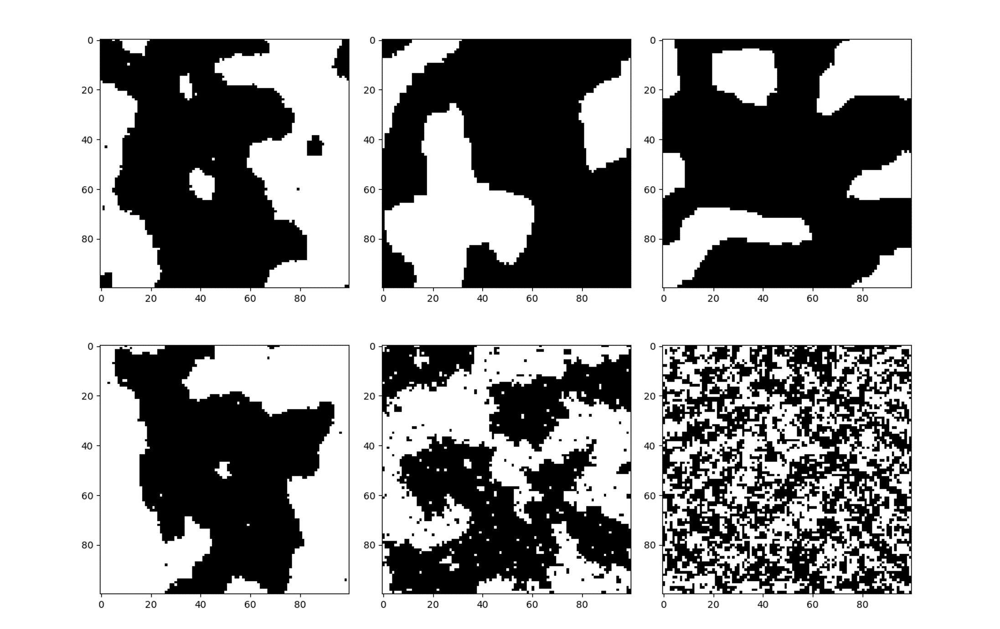

# Classification and Analysis of phase of matter by machine learning
> My own version of codes

## Features
+ Home-made Ising model calculation with Monte Carlo Simulation

+ Convolutional Neural Networks

## Requirements
+ Numpy, Matplotlib
+ Keras, Tensorflow

## How to use
+ Train and test model for detecting phase of matter

        cd phaseofmatter
        python trainmodel.py

## References
[1]Carrasquilla J, Melko R G. Machine learning phases of matter[J]. Nature Physics, 2017.  
[2]van Nieuwenburg E P L, Liu Y H, Huber S D. Learning phase transitions by confusion[J]. Nature Physics, 2017, 13(5): 435-439.